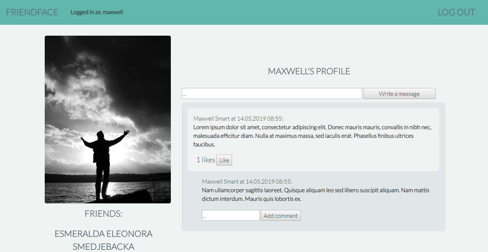

Language: Java 

Created: 4-5/2019 (Java experience: 4-5 months)

Keywords: Java, Thymeleaf, Spring Boot, Hibernate, Lombok, Bootstrap, CSS, H2

FriendFace is a solo social media project. It was a course project for the "Server-side web development Java" course at Helsinki Open Uni. The purpose of the exercice was to re-create a Facebook of it's early times.

It allows registered users to:

- add pictures
- send friend requests
- write on the walls of users
- comment and like pictures and wall messages

Picture Source: http://www.freestockphotos.biz/, licensed under either CC or FSP Standard License. 
Picture credits:
Eugenijus Radlinskas, Benjamin Miller, Petr Kratochvil, Free Stock Photos Library, FSP Vintage Collection, Mitra Mirshahidi, Amanda Mills
